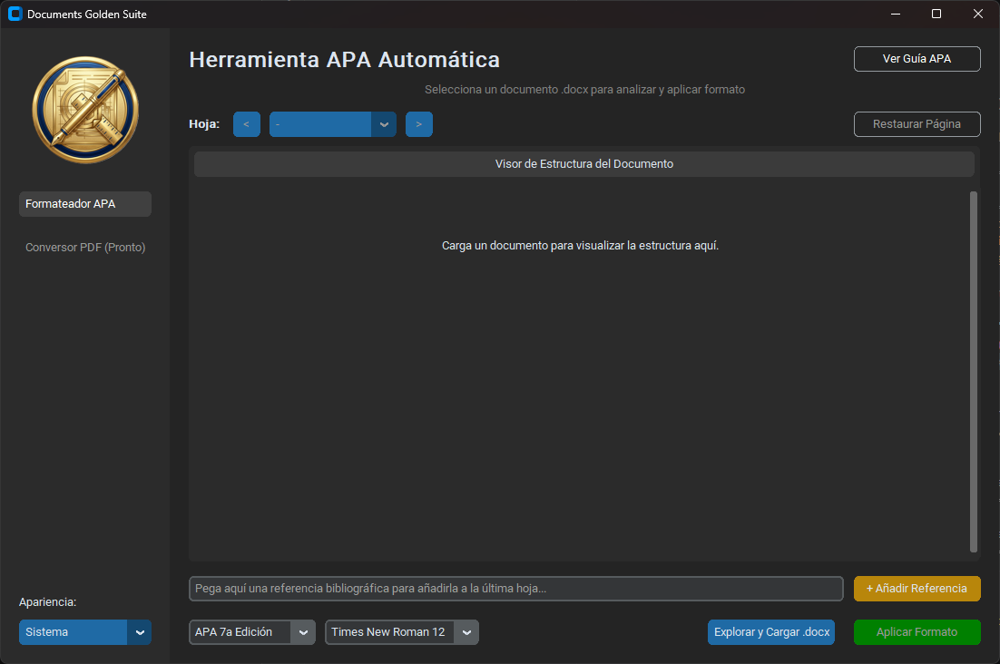

# Documents Golden Suite 

Una herramienta de escritorio profesional y minimalista desarrollada en Python para la gestión y formateo automatizado de documentos académicos, comenzando con la estandarización a normas APA (6ª y 7ª edición).



## Características Principales (v1.0)

* **Visor Lógico Paginado:** Extrae la estructura interna de documentos `.docx` sin sobrecargar la memoria, permitiendo auditar y reasignar estilos (Títulos, Párrafos Normales) visualmente.
* **Motor APA Automático:** Aplica reglas globales de márgenes (2.54 cm), interlineado doble y tipografía estándar con un solo clic.
* **Soporte Multi-Edición:** Ajusta la jerarquía de títulos y fuentes permitidas dependiendo de si se selecciona APA 6 o APA 7.
* **Inyector de Referencias:** Permite pegar referencias bibliográficas en texto plano para que el motor las formatee con Sangría Francesa y las anexe en una nueva página al final del documento.
* **Interfaz Moderna:** Construida con `customtkinter`, cuenta con un diseño modular (Sidebar) y soporte nativo para modos Claro y Oscuro.

## Tecnologías Utilizadas

* **Python 3.10+**
* **CustomTkinter:** Para la interfaz gráfica de usuario (GUI).
* **Python-docx:** Para la lectura, manipulación del árbol XML y guardado de documentos Word.
* **Pillow:** Para el renderizado de gráficos y logotipos.

## Instalación y Ejecución Local

1. Clona el repositorio:
   ```bash
   git clone [https://github.com/GoldenFenix92/Documents-Golden-Suite.git](https://github.com/GoldenFenix92/Documents-Golden-Suite.git)