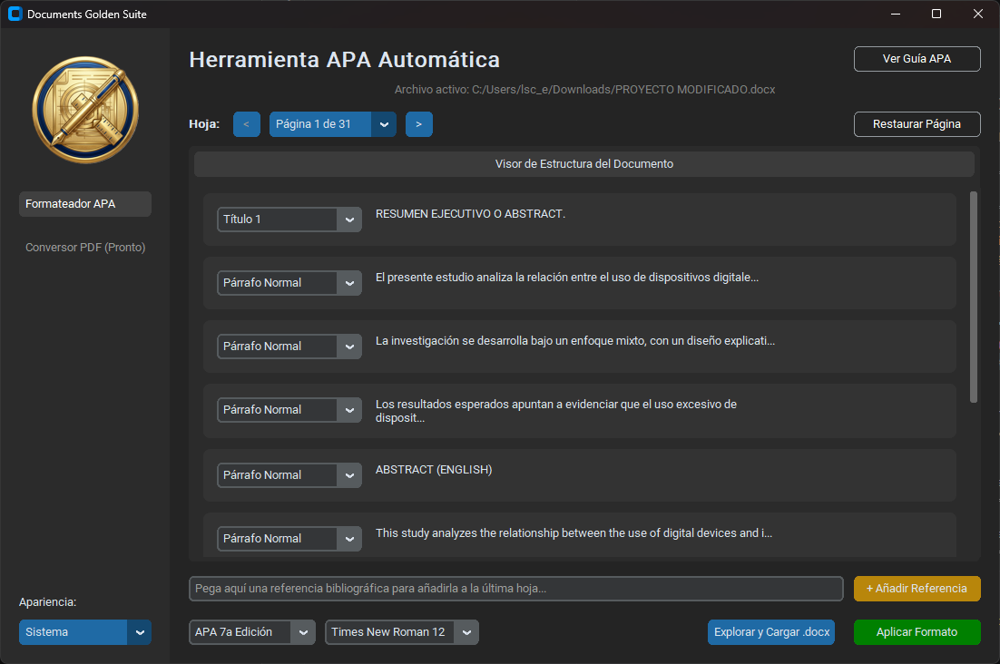
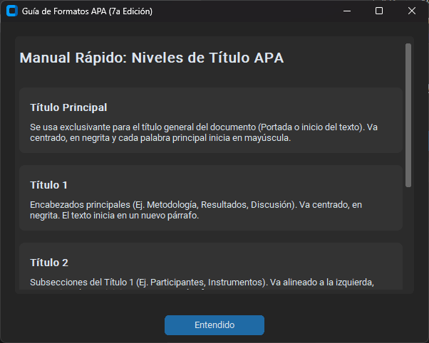

Este archivo guía al usuario final paso a paso. Cópialo y pégalo en el archivo correspondiente dentro de tu carpeta `docs`.

```markdown
# Manual de Usuario: Formateador APA Auto

Bienvenido a la herramienta de formateo APA de Documents Golden Suite. Este manual detalla cómo procesar un documento `.docx` en bruto para adaptarlo a los estándares de la American Psychological Association.

## 1. Carga del Documento y Visor Lógico

Para comenzar, seleccione la opción "Explorar y Cargar .docx" en el panel inferior. La aplicación leerá la estructura de su documento y la mostrará en el **Visor Lógico**.



* **Paginación Virtual:** Para mantener un rendimiento óptimo, los párrafos se agrupan en bloques. Utilice los controles `<` y `>` para navegar por su documento.
* **Mapeo de Estilos:** A la izquierda de cada fragmento de texto verá una lista desplegable. El programa intenta detectar automáticamente si el texto es un Párrafo Normal o un Título basándose en los metadatos de Word.
* **Corrección Manual:** Si detecta que un título importante está etiquetado como "Párrafo Normal", simplemente despliegue la lista y cámbielo a "Título 1", "Título 2", etc., antes de procesar el archivo.

## 2. Inyección de Referencias Bibliográficas

Las normas APA requieren que la bibliografía tenga "Sangría Francesa". Puede manejar esto de dos formas:
1. Si sus referencias ya están en el texto, asígneles el estilo **"Referencia"** en el Visor Lógico.
2. Si desea agregar referencias nuevas, utilice el inyector ubicado debajo del visor.


Pegue su referencia sin formato en el cuadro de texto y haga clic en **"+ Añadir Referencia"**. El sistema las guardará en memoria y creará automáticamente una hoja de Bibliografía al final del documento procesado.

## 3. Configuración y Procesamiento

Una vez que la estructura en el visor sea la correcta, diríjase al panel de control inferior:

1. **Seleccione la Versión:** Elija entre APA 7ª Edición o APA 6ª Edición.
2. **Seleccione la Fuente:** (Solo disponible para APA 7). Elija entre opciones permitidas como Times New Roman 12, Arial 11, Calibri 11 o Georgia 11.
3. Haga clic en **Aplicar Formato**. 

El sistema le preguntará si desea aplicar el formato a la página actual del visor o a todo el documento. Se recomienda aplicarlo a todo el documento. Se generará un nuevo archivo con el sufijo `_APA_PROCESADO.docx` en la misma carpeta que el original, manteniendo su archivo fuente intacto.

## Anexo: Guía Rápida de Títulos APA

Si tiene dudas sobre qué nivel de título asignar en el Visor Lógico, puede consultar la guía integrada en cualquier momento haciendo clic en el botón **"Ver Guía APA"** ubicado en la esquina superior derecha.

